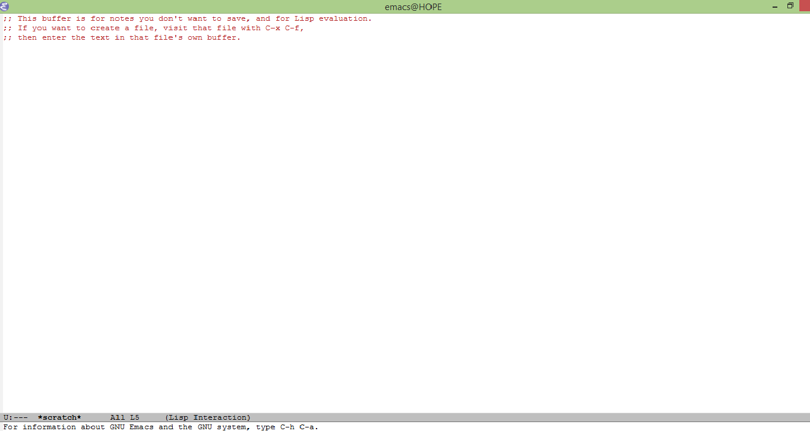

How to train your Emacs.
========================

Extensions to the GNU Emacs editor are written in the programming
language called Emacs Lisp. Actually most of the editor itself is
written in that language, only a small part of it uses C and assembly.
However Emacs Lisp is more than a simple scripting language; it is as
powerfull as any other computer programming language in the neighborhood
but it is designed for use within the editor. As such, Emacs Lisp has
special features for parsing text, working with buffers, handling files
and all other things Emacs. In this chapter I will talk about the
packages, the configuration system, and have a first look at how to
write an Emacs init file.

Emacs comes preloaded with.

Overall there are three kind of packages:

-   Themes (as in \"Emacs looks pretty\").
-   Support packages (a.k.a libraries and some useful commands).
-   Modes (where the real magic happens)

All of these can be configured and extended in any way you like, it all
depends on how far are you willing to go down the rabbit hole.

[TODO]{.todo .TODO} Configuration, the easy way. {#configuration-the-easy-way.}
------------------------------------------------

Most of the poeple believe that configuring Emacs involves dealing with
some kind of Lisp mumbo jumbo. Well, while sometimes it does there\'s a
lot we can accomplished by using the *customization interface*.

Configuration, the good way.
----------------------------

When you launch the editor, it search you `HOME` directory for the \"the
init file\". This is a file holding any customizations you have made and
it\'s usually called `.emacs` (in really old Windows versions it was
call ~emacs~ due to some limitations with the DOS and FAT filesystems).
After version `22` the convention is to use a directory called
`.emacs.d` with a file named `init.el`. This directory will also hold
every package created file so this keeps all your editor related code in
one place.

Now let\'s see an example init file

``` {.commonlisp org-language="emacs-lisp"}
;; -*- coding: utf-8 -*-
;;; init.el
;;; Emacs configuration file

;; Copyright (C) 2012-2013
;; Author: Yoandy Rodríguez <yoandy.rmartinez@gmail.com>
;; Version: 0.1
;; Removes the menu bar
(when (fboundp 'menu-bar-mode) (menu-bar-mode -1))
;; Removes the toolbar
(when (fboundp 'tool-bar-mode) (tool-bar-mode -1))
;; Removes the scroll bar on the windows's edge
(when (fboundp 'scroll-bar-mode) (scroll-bar-mode -1))
;; Removes the initial splash screen and the
;; really annoying message.
(setq inhibit-splash-screen t)
(setq inhibit-startup-message t)
;; Set's default coding system to UTF-8
(setq locale-coding-system 'utf-8) ; pretty
(set-terminal-coding-system 'utf-8) ; pretty
(set-keyboard-coding-system 'utf-8) ; pretty
(set-selection-coding-system 'utf-8) ; please
(prefer-coding-system 'utf-8) ; do it.
```

Open your (soon to be former) favorite editor and save the code above in
a `.emacs.d/init.el` file. Now restart Emacs (close the editor window
and open it again), it should look like
\hyperref[fig:emacs-first-init]{Figure 2.1}.



But what exactly did we do on the init file and where did I get names
like `locale-coding-system` and `fboundp`? Those are variables and
function names defined within the editor. You see, Emacs doesn\'t only
read ELisp (short for Emacs Lisp) code, it is a Elisp runtime
environment. We\'ll talk more about ELisp in the next chapter.

Changing your default theme.
----------------------------

Some people like bright colors, some like dark ones, while others
require special or high contrasts colors. Themes are collection of
visual settings that can be enabled or disabled as a unit. To access the
themes configuration buffer run `customize-themes` and start selecting
till you find the one you like. In your init file you can call
`load-theme` using a theme\'s name as a symbol.

``` {.commonlisp org-language="emacs-lisp"}
(load-theme 'leuven) ; set's leuven as my default theme
```

There are 12 default themes[^1] and like 30 or so in every package
archive so I encourage you to try every one till you find a perfect
match!

Modes and support libraries
---------------------------

Early Emacs modes where often a few Kbytes long so it made sense to pack
them as a single file. The installation process required you to manually
download the `.el` files and place them somewhere in your `.emacs.d`
directory. If the package had dependencies then thigs could get
complicated, now you had to locate and download the correct version of
the dependent package and any transitive dependency too. Something had
to change.

Around version `22` the idea of simple, unified way to download and
install new modes came to life in with the *simple package system for
emacs* or `package.el`. Soon after that MELPA[^2] and Marmalade[^3] came
to life listing hundreds of packages.

We can start using `package.el` by adding this to the init file:

``` {.commonlisp org-language="emacs-lisp"}
;; Activates the package system
(require 'package)
;; and sets Melpa as the default package source
(setq package-archives '(
         ("melpa" . "http://melpa.org/packages/")))
(package-initialize)
```

There\'s nothing wrong with having more than one package archive, but
people usually settle for either MELPA or Marmalade[^4]. Now execute the
`list-packages` command. After a few seconds of downloading the archives
a `Package Menu` buffer will open. `Package menu` is an special buffer
(a.k.a. not for typing) with quite a few commands. I will teach you five

-   `i` marks a package for install.
-   `d` marks for uninstall.
-   `u` unmarks a previously marked package.
-   `x` executes any pending install or uninstall operation.
-   `U` (that\'s capital U or `S-u`) marks multiple package for update.


We can also I-search using `C-s` and `C-r` and there\'s a (not really
useful) filter command in `f`.

As an alternative to `package.el` we can either use `el-get` (kind of
`apt-get` for Emacs) or `use-package` but having **two** package manages
seems like an overkill to me so I stick with the old `package.el`.

Footnotes
=========

[^1]: That is for Emacs 24.5

[^2]: <http://melpa.org/packages/>

[^3]: <http://marmalade-repo.org/packages/>

[^4]: There\'s an official GNU Package archive, but it\'s kind of the
    ugly sister in this story.
